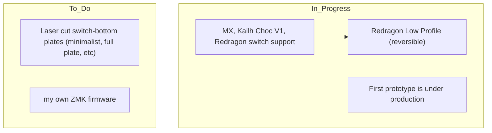
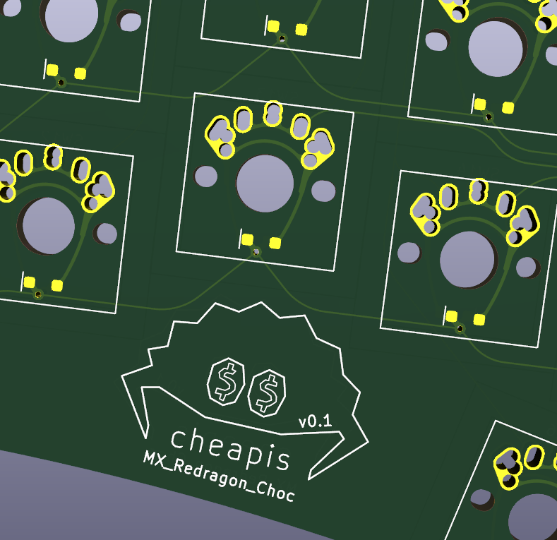

- Kicad 9.0 or newer maybe required
- This project aims to change only the switch being used while minimizing changes to everything else to maintain the best compatibility.
- This is my first time using KiCad. May you and the Lord forgive me if files contain any mistakes or issues (It's the reason why I remove the support for both MX and Choc V1, I wasn't sure if I can make it work).
- [Redragon Low Profile footprint]( https://github.com/rgoulter/keyboard-labs/blob/master/pcb/ProjectLocal.pretty/SW_Redragon_LowProfile_PCB_1.00u.kicad_mod
) is from  [Rgoulter](https://github.com/rgoulter). Kudos to this man.

Original PCB

Redragon PCB

If I just put redragon footprint on top of the old design, I think this will work with minimal change to the number 2 pad (make it smaller ?) I will try, 2$ per order anyway.

The tri-switch-supported version (MX, Redragon, Choc) will have different stem hole cutouts, with MX and Choc featuring larger openings than Redragon. To prevent short circuits, Redragon switch pins have to be bent when installed.

First Protorype I ordered on JLCPCB

# cheapis (The Original)

v0.1 issues:
- most ubs cables cannot be plugged in when the pro micro is soldered in an usual way (upright, with the usually included pins), because of the top middle buttons. It has to be solderes upside down, flush with the keyboard pcb.
- not really an issue, but SOD-323 diodes are challenging to solder. They're also not the cheapest, although the difference is minuscule.

Cheapis was inspired by ferris and sweep.

It is the cheapest alternative to the above keyboards (that still has a PCB) as it is sub 100x100mm in size so it can be ordered for a very low price and it only needs one controller (Pro Micro or alternative).

Specs:
- Split
- Unibody
- 34 key
- Compatible with MX, Kailh Choc v1 and Gateron low profile switches
- needs 1n4148 SOD-323 diodes
- 19mm standard spacing
- angled sides by 20 degree

Pros:
- less than 100x100mm
- reversible, so you can order less
- needs ony one Pro Micro or alternative
- very cheap way to experiment with 34 key layout

Cons:
- it has to be unibody
- tenting is not possible
- fragile without a plate as the Pro Micro keeps the two sides together
- not much features, it's hardly more than a hardwire
